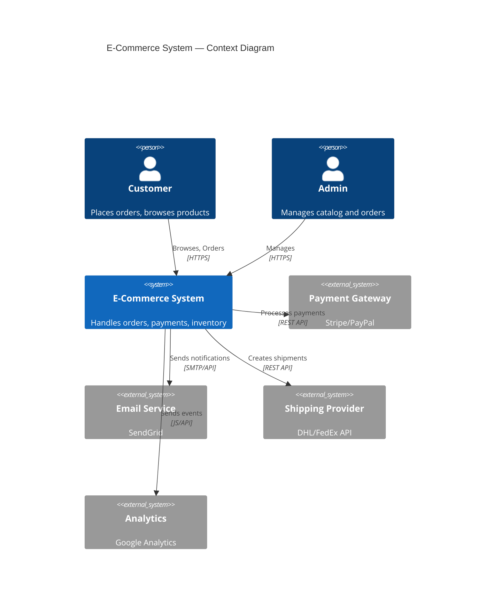
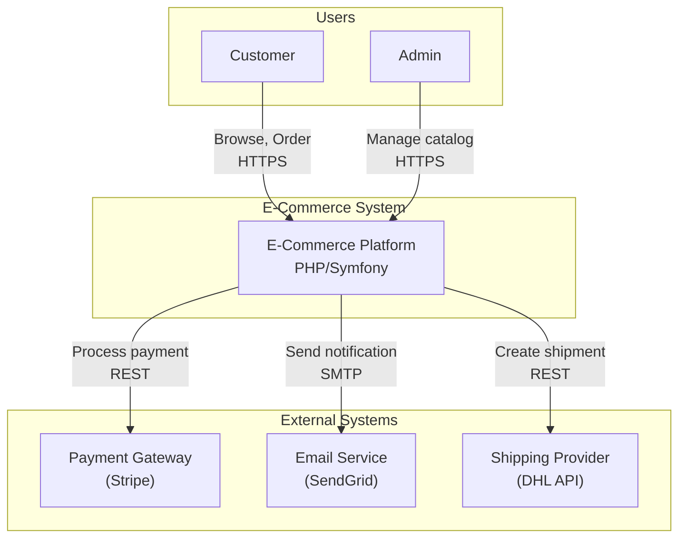
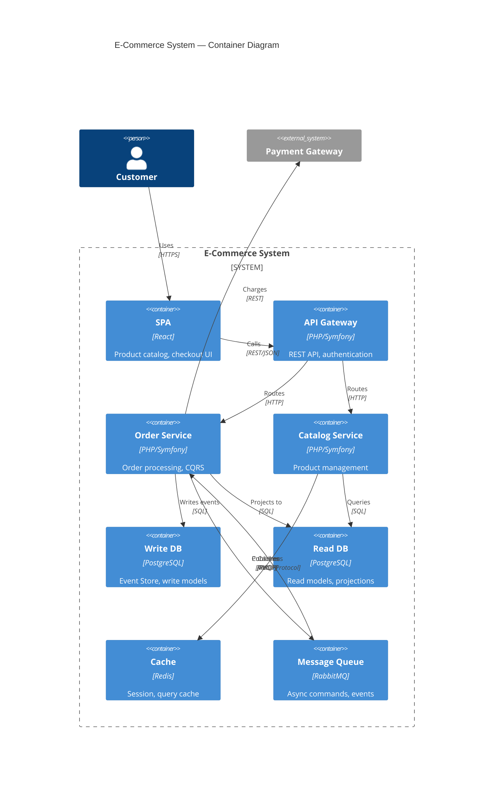
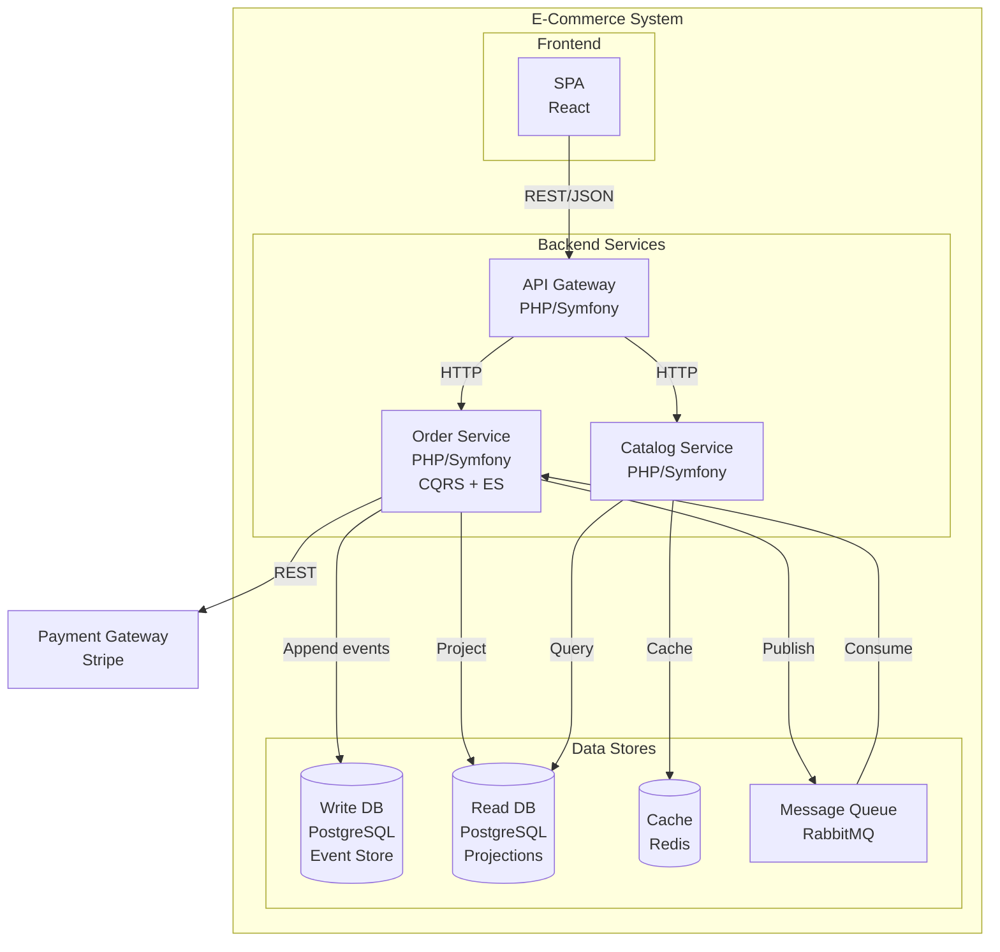
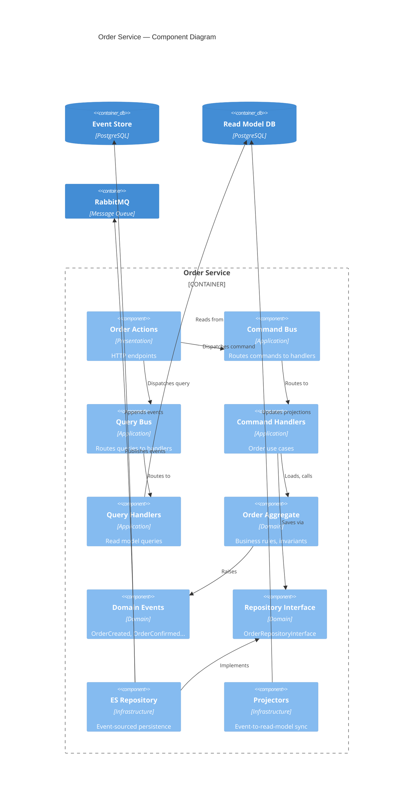
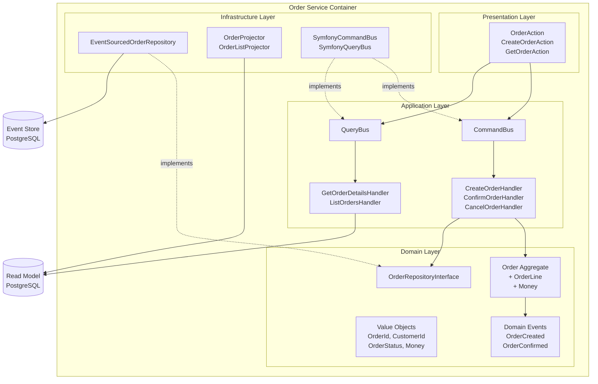
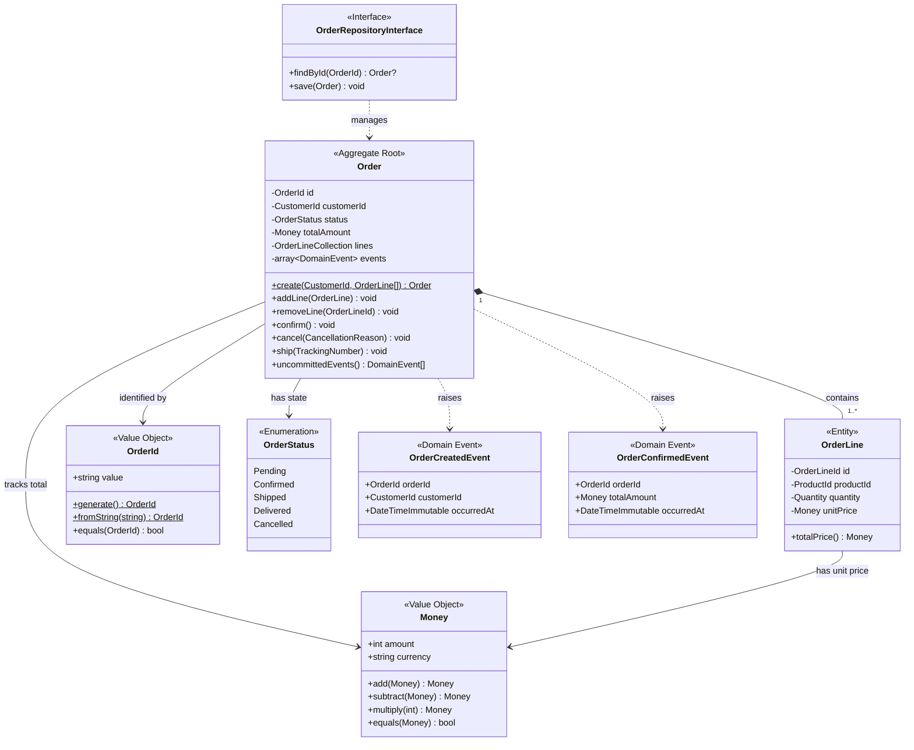
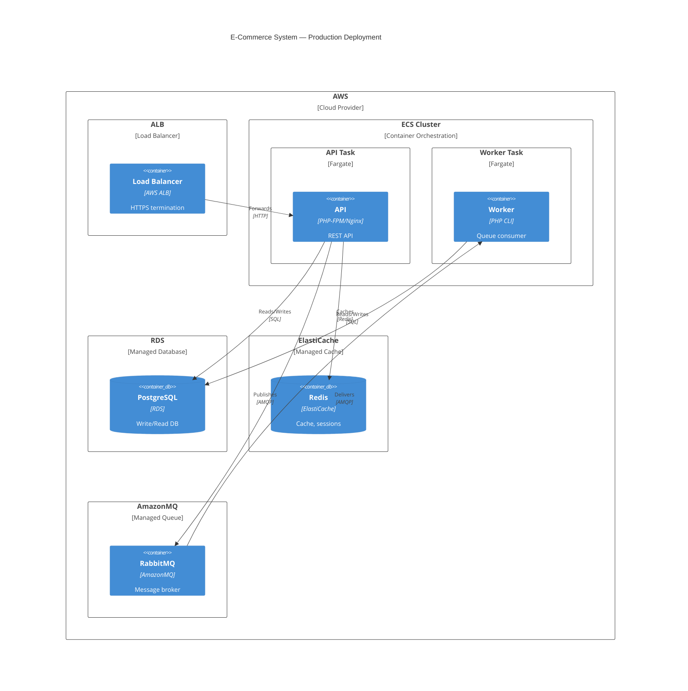
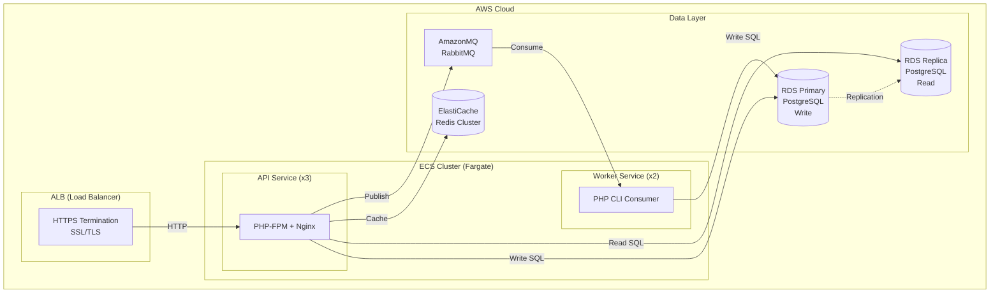
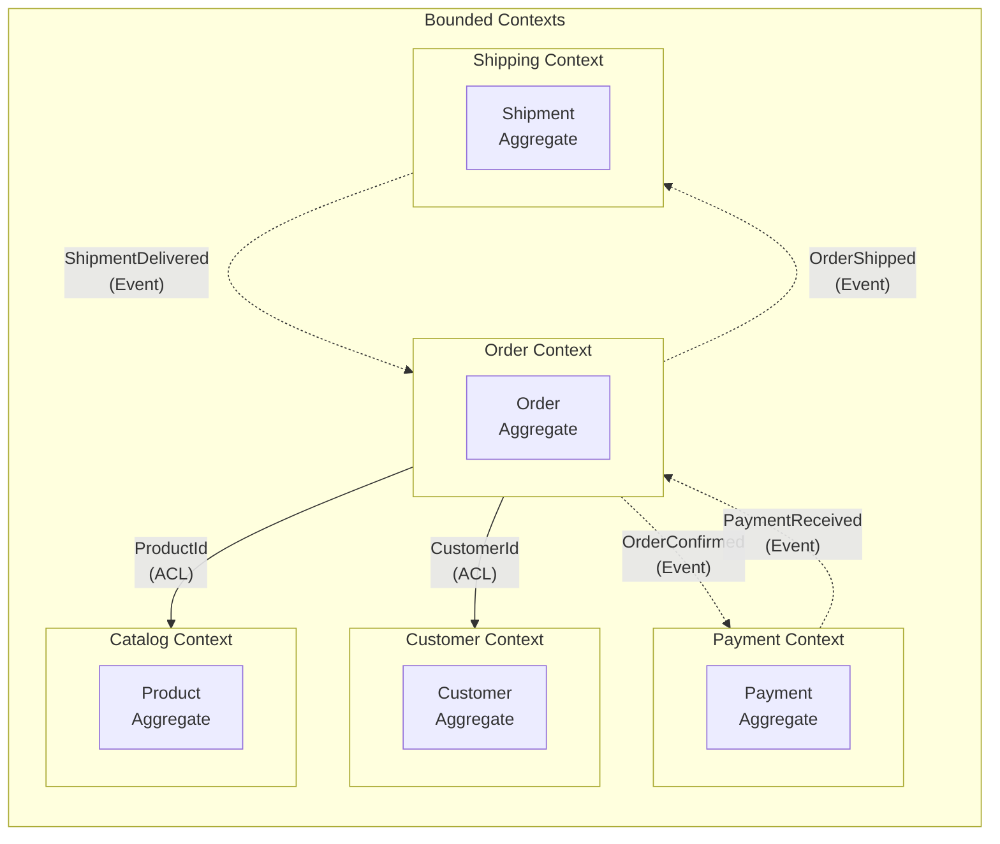

# C4 Model Reference

Detailed guide for C4 model diagrams in PHP DDD/CQRS projects using Mermaid syntax.

## C4 Model Overview

### What is the C4 Model?

A hierarchical approach to software architecture visualization with four abstraction levels, from system context down to code.

### C4 Levels

| Level | Name | Audience | What to Show | Scope |
|-------|------|----------|--------------|-------|
| **1** | Context | Everyone | System + external actors + external systems | Whole landscape |
| **2** | Container | Technical leads, architects | Deployable units (apps, DBs, queues) | Single system |
| **3** | Component | Developers | Modules, bounded contexts, layers | Single container |
| **4** | Code | Developers | Classes, interfaces, relationships | Single component |

## Level 1: System Context Diagram

### Purpose

Shows the system under design and its relationships with users and external systems.

### Mermaid C4Context Syntax



### Flowchart Alternative (Broader Compatibility)



### When to Use Level 1

- Stakeholder presentations
- Onboarding new team members
- Defining system boundaries
- Identifying external dependencies

## Level 2: Container Diagram

### Purpose

Shows the high-level technology choices and how containers communicate within the system.

### Mermaid C4Container Syntax



### Flowchart Alternative



### When to Use Level 2

- Architecture decision records
- DevOps and deployment planning
- Technology stack discussions
- Infrastructure cost estimation

## Level 3: Component Diagram

### Purpose

Shows the internal structure of a single container, focusing on bounded contexts and DDD layers.

### Mermaid C4Component Syntax



### Flowchart Alternative (Bounded Contexts)



### When to Use Level 3

- Sprint planning for specific services
- Code review discussions
- DDD bounded context mapping
- New developer orientation to a service

## Level 4: Code Diagram

### Purpose

Shows class-level detail for a specific component. Use sparingly — only for complex aggregates or critical domain logic.

### Order Aggregate Class Diagram



### When to Use Level 4

- Documenting complex aggregates
- Reviewing domain model design
- Onboarding to specific bounded context
- Detecting DDD violations (anemic model, broken invariants)

## C4 Deployment Diagram

### Purpose

Shows how containers map to infrastructure nodes in production.

### Mermaid C4Deployment Syntax



### Flowchart Alternative



## C4 in PHP DDD Projects

### Bounded Context Map (Level 1.5)



### DDD Layer Mapping to C4

| C4 Level | DDD Concept | What to Show |
|----------|-------------|--------------|
| Context | Bounded Contexts | Context map with relationships |
| Container | Deployable services | Service per bounded context (or monolith) |
| Component | DDD Layers | Presentation, Application, Domain, Infrastructure |
| Code | Domain Model | Aggregates, Entities, Value Objects, Events |

## Best Practices

### Do's and Don'ts

| Do | Don't |
|----|-------|
| Start at Level 1, zoom in as needed | Jump straight to Level 4 |
| Keep 5-9 elements per diagram | Cram everything into one view |
| Update diagrams when architecture changes | Let diagrams go stale |
| Use consistent notation across team | Mix C4 with ad-hoc boxes |
| Store diagrams as code (Mermaid in repo) | Use binary diagram files |
| Label relationships with protocol/data | Leave arrows unlabeled |

### Diagram Naming Convention

```
docs/diagrams/
  c4-context.md          # Level 1
  c4-container.md        # Level 2
  c4-component-order.md  # Level 3 per service
  c4-code-order-agg.md   # Level 4 per aggregate (rare)
  c4-deployment-prod.md  # Deployment view
```

## Detection Patterns

```bash
# Check for C4 diagrams in project
Grep: "C4Context|C4Container|C4Component|C4Deployment" --glob "**/*.md"

# Check for architecture documentation
Glob: **/docs/diagrams/*.md
Glob: **/ARCHITECTURE.md

# Check for bounded context mapping
Grep: "Bounded Context|Context Map|context map" --glob "**/*.md"

# Check for deployment diagrams
Grep: "C4Deployment|deployment.*diagram" --glob "**/*.md"

# Warning: Missing C4 diagrams
Grep: "flowchart|sequenceDiagram" --glob "**/ARCHITECTURE.md"
# If found but no C4 keywords — suggest upgrading to C4 model
```

## Summary

| Level | Audience | What to Show | Update Frequency | Example Trigger |
|-------|----------|--------------|------------------|-----------------|
| **Context** | All stakeholders | System + actors + external systems | Quarterly / new integration | New external dependency |
| **Container** | Tech leads, DevOps | Apps, DBs, queues, caches | Monthly / infra change | New service or database |
| **Component** | Developers | Layers, modules, bounded contexts | Per sprint / refactor | New aggregate or module |
| **Code** | Developers | Classes, interfaces, relationships | On demand / review | Complex aggregate design |
| **Deployment** | DevOps, SRE | Infra nodes, scaling, networking | Per release / infra change | New environment or scaling |
