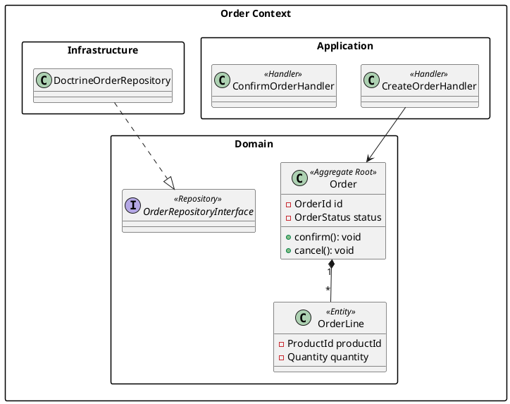
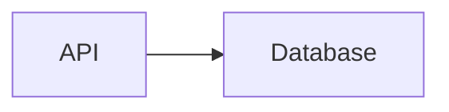
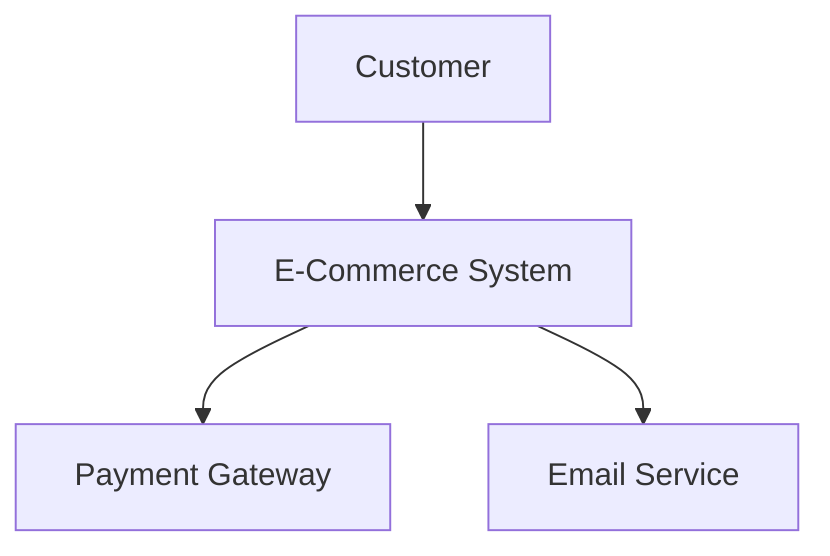
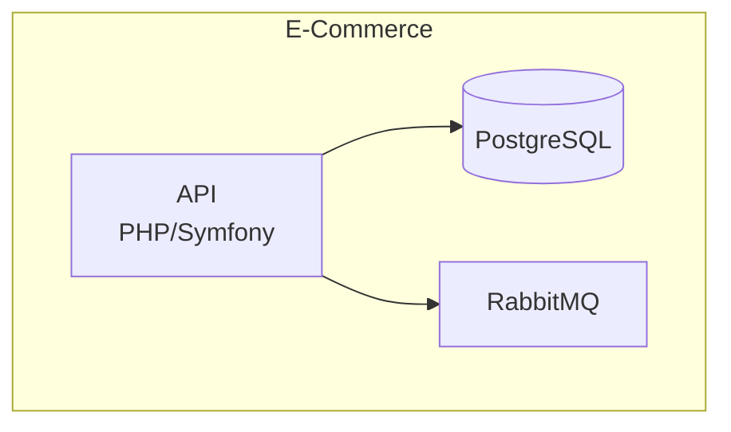

# Diagram Tools Reference

Tools, automation, and workflows for generating and maintaining technical diagrams in PHP DDD/CQRS projects.

## Mermaid CLI (mmdc)

### Installation

```bash
npm install -g @mermaid-js/mermaid-cli

# Or project-local
npm install --save-dev @mermaid-js/mermaid-cli
```

### Usage

```bash
# Single file rendering
mmdc -i diagram.mmd -o diagram.png
mmdc -i diagram.mmd -o diagram.svg
mmdc -i diagram.mmd -o diagram.pdf

# With custom theme
mmdc -i diagram.mmd -o diagram.svg -t dark
mmdc -i diagram.mmd -o diagram.svg -t forest

# With puppeteer config (for CI headless rendering)
mmdc -i diagram.mmd -o diagram.svg -p puppeteer-config.json

# Batch rendering
find docs/diagrams -name "*.mmd" -exec mmdc -i {} -o {}.svg \;
```

### CI/CD Integration (GitHub Actions)

```yaml
# .github/workflows/diagrams.yml
name: Render Diagrams
on:
  push:
    paths:
      - 'docs/diagrams/**/*.mmd'
      - 'docs/**/*.md'

jobs:
  render:
    runs-on: ubuntu-latest
    steps:
      - uses: actions/checkout@v4
      - uses: actions/setup-node@v4
        with:
          node-version: '20'
      - run: npm install -g @mermaid-js/mermaid-cli
      - run: |
          for file in docs/diagrams/*.mmd; do
            mmdc -i "$file" -o "${file%.mmd}.svg" -p puppeteer-config.json
          done
      - uses: actions/upload-artifact@v4
        with:
          name: diagrams
          path: docs/diagrams/*.svg
```

### Puppeteer Config for CI

```json
{
  "executablePath": "/usr/bin/chromium-browser",
  "args": ["--no-sandbox", "--disable-setuid-sandbox"]
}
```

## PlantUML

### When to Use Instead of Mermaid

| Scenario | Use PlantUML | Use Mermaid |
|----------|-------------|-------------|
| Strict UML compliance | Yes | No |
| Complex class hierarchies | Yes | Partial |
| GitHub/GitLab rendering | No | Yes |
| CI without Java | No | Yes |
| Sequence diagram detail | Yes | Yes |
| Architecture Decision Records | Either | Either |

### PlantUML Setup

```bash
# Docker (recommended for CI)
docker run -d -p 8080:8080 plantuml/plantuml-server:jetty

# Java (local dev)
java -jar plantuml.jar diagram.puml

# VS Code extension
# Install "PlantUML" by jebbs
```

### PlantUML DDD Example



## Structurizr (C4 Model Tool)

### Structurizr Lite (Free, Self-Hosted)

```bash
# Docker setup
docker run -d -p 8080:8080 \
  -v ./structurizr:/usr/local/structurizr \
  structurizr/lite
```

### Structurizr DSL for PHP DDD

```
workspace "E-Commerce" "DDD/CQRS E-Commerce System" {
    model {
        customer = person "Customer" "Places orders"
        admin = person "Admin" "Manages catalog"

        ecommerce = softwareSystem "E-Commerce System" {
            spa = container "SPA" "React" "Web Application"
            api = container "API" "PHP/Symfony" "REST API" {
                orderAction = component "Order Actions" "Presentation"
                commandBus = component "Command Bus" "Application"
                queryBus = component "Query Bus" "Application"
                orderAggregate = component "Order Aggregate" "Domain"
                orderRepo = component "Order Repository" "Infrastructure"
            }
            database = container "Database" "PostgreSQL" "Event Store"
            cache = container "Cache" "Redis" "Query Cache"
            queue = container "Queue" "RabbitMQ" "Event Bus"
        }

        paymentGateway = softwareSystem "Payment Gateway" "Stripe"

        customer -> spa "Uses" "HTTPS"
        spa -> api "Calls" "REST/JSON"
        api -> database "Reads/Writes" "SQL"
        api -> cache "Caches" "Redis"
        api -> queue "Publishes" "AMQP"
        api -> paymentGateway "Charges" "REST"
    }

    views {
        systemContext ecommerce "Context" {
            include *
            autoLayout
        }
        container ecommerce "Containers" {
            include *
            autoLayout
        }
        component api "Components" {
            include *
            autoLayout
        }
    }
}
```

### Structurizr vs Mermaid C4

| Feature | Structurizr | Mermaid C4 |
|---------|-------------|------------|
| Model-first approach | Yes (DSL defines model) | No (each diagram standalone) |
| Automatic layout | Yes | No |
| Multiple views from one model | Yes | No (manual per view) |
| Free self-hosted | Yes (Lite) | Yes |
| Git-friendly | Yes (DSL files) | Yes (Markdown) |
| No install required | No (Docker/Java) | Yes (GitHub renders) |
| Interactive diagrams | Yes (web UI) | No |

## GitHub / GitLab Mermaid Rendering

### GitHub Native Support

Mermaid diagrams render automatically in GitHub Markdown files:

````markdown

````

**Supported locations:**
- README.md and any .md files
- Pull request descriptions and comments
- Issue descriptions and comments
- Wiki pages

### GitLab Native Support

Same syntax as GitHub. Additionally supports:

```markdown
<!-- GitLab also supports -->
```plantuml
Bob -> Alice : hello
```
```

### Limitations

| Limitation | GitHub | GitLab |
|------------|--------|--------|
| Max diagram size | ~50KB source | ~50KB source |
| C4 diagram support | Partial | Partial |
| Custom themes | No | No |
| Click interactions | No | No |
| Export from rendered | Screenshot only | Screenshot only |

## Auto-Generating Diagrams from Code

### Deptrac (Dependency Analysis)

```bash
# Install
composer require --dev qossmic/deptrac-shim

# Generate dependency graph
vendor/bin/deptrac analyse --formatter=graphviz --output=docs/diagrams/dependencies.dot

# Convert to SVG
dot -Tsvg docs/diagrams/dependencies.dot -o docs/diagrams/dependencies.svg
```

#### Deptrac Config for DDD Layers

```yaml
# deptrac.yaml
deptrac:
  paths:
    - ./src
  layers:
    - name: Presentation
      collectors:
        - type: directory
          value: src/.*/Presentation/.*
    - name: Application
      collectors:
        - type: directory
          value: src/.*/Application/.*
    - name: Domain
      collectors:
        - type: directory
          value: src/.*/Domain/.*
    - name: Infrastructure
      collectors:
        - type: directory
          value: src/.*/Infrastructure/.*
  ruleset:
    Presentation:
      - Application
    Application:
      - Domain
    Infrastructure:
      - Domain
    Domain: ~
```

### phpDocumentor (Class Diagrams)

```bash
# Generate UML class diagrams
docker run --rm -v $(pwd):/data phpdoc/phpdoc:3 \
  run -d ./src -t ./docs/api --template="default"

# Generates class diagrams in docs/api/graphs/
```

### Custom Script: Generate Mermaid from PHP

```php
<?php

declare(strict_types=1);

/**
 * Generates Mermaid class diagram from PHP namespace.
 *
 * Usage: php generate-diagram.php src/Domain/Order > docs/diagrams/order-domain.mmd
 */

$directory = $argv[1] ?? throw new InvalidArgumentException('Provide directory path');

$classes = [];
$relationships = [];

$iterator = new RecursiveIteratorIterator(
    new RecursiveDirectoryIterator($directory)
);

foreach ($iterator as $file) {
    if ($file->getExtension() !== 'php') {
        continue;
    }

    $content = file_get_contents($file->getPathname());

    // Extract class name
    if (preg_match('/class\s+(\w+)/', $content, $match)) {
        $className = $match[1];
        $classes[$className] = [];

        // Extract properties
        preg_match_all('/(?:private|public|protected)\s+(?:readonly\s+)?(\w+)\s+\$(\w+)/', $content, $props);
        foreach ($props[2] as $i => $prop) {
            $classes[$className][] = "-{$props[1][$i]} {$prop}";
        }

        // Extract extends
        if (preg_match('/extends\s+(\w+)/', $content, $ext)) {
            $relationships[] = "{$ext[1]} <|-- {$className}";
        }

        // Extract implements
        if (preg_match('/implements\s+([\w,\s]+)/', $content, $impl)) {
            foreach (explode(',', $impl[1]) as $interface) {
                $relationships[] = trim($interface) . " <|.. {$className}";
            }
        }
    }
}

echo "classDiagram\n";
foreach ($classes as $name => $members) {
    echo "    class {$name} {\n";
    foreach ($members as $member) {
        echo "        {$member}\n";
    }
    echo "    }\n";
}
foreach ($relationships as $rel) {
    echo "    {$rel}\n";
}
```

### Makefile Integration

```makefile
# Makefile targets for diagram generation

.PHONY: diagrams diagrams-deps diagrams-domain diagrams-render

diagrams: diagrams-deps diagrams-domain diagrams-render  ## Generate all diagrams

diagrams-deps:  ## Generate dependency diagram with Deptrac
	vendor/bin/deptrac analyse --formatter=graphviz --output=docs/diagrams/dependencies.dot
	dot -Tsvg docs/diagrams/dependencies.dot -o docs/diagrams/dependencies.svg

diagrams-domain:  ## Generate domain model diagrams
	php bin/generate-diagram.php src/Domain/Order > docs/diagrams/order-domain.mmd
	php bin/generate-diagram.php src/Domain/Catalog > docs/diagrams/catalog-domain.mmd

diagrams-render:  ## Render Mermaid diagrams to SVG
	@for file in docs/diagrams/*.mmd; do \
		mmdc -i "$$file" -o "$${file%.mmd}.svg"; \
	done
```

## Diagram-as-Code Workflow

### Recommended Project Structure

```
project/
  docs/
    ARCHITECTURE.md          # Main architecture doc (embeds Mermaid)
    diagrams/
      c4-context.mmd         # Level 1 source
      c4-container.mmd       # Level 2 source
      c4-component-order.mmd # Level 3 per service
      order-sequence.mmd     # Key flows
      *.svg                  # Rendered output (gitignored or committed)
    adr/                     # Architecture Decision Records
      0001-use-cqrs.md
      0002-event-sourcing.md
```

### ARCHITECTURE.md Template

````markdown
# Architecture

## System Context (C4 Level 1)



## Container Diagram (C4 Level 2)



## Key Flows

### Order Creation
See [Order Sequence Diagram](diagrams/order-sequence.mmd)
````

### Pre-Commit Hook for Diagram Validation

```bash
#!/bin/bash
# hooks/validate-diagrams.sh

# Check that Mermaid syntax is valid
for file in $(git diff --cached --name-only -- '*.mmd' '*.md'); do
    if grep -q '```mermaid' "$file" || [[ "$file" == *.mmd ]]; then
        echo "Validating Mermaid in $file..."
        # Extract and validate mermaid blocks
        mmdc -i "$file" -o /dev/null 2>/dev/null
        if [ $? -ne 0 ]; then
            echo "ERROR: Invalid Mermaid syntax in $file"
            exit 1
        fi
    fi
done
```

## Detection Patterns

```bash
# Check for diagram documentation
Glob: **/docs/diagrams/*
Glob: **/ARCHITECTURE.md

# Check for Mermaid files
Glob: **/*.mmd

# Check for diagram generation tools
Grep: "deptrac" --glob "**/composer.json"
Grep: "mermaid-cli|@mermaid-js" --glob "**/package.json"
Grep: "plantuml" --glob "**/composer.json"

# Check for diagram automation in CI
Grep: "mmdc|mermaid|plantuml" --glob "**/.github/workflows/*.yml"
Grep: "mmdc|mermaid|plantuml" --glob "**/.gitlab-ci.yml"

# Check for Makefile diagram targets
Grep: "diagram" --glob "**/Makefile"

# Warning: Binary diagram files in repo
Glob: **/*.drawio
Glob: **/*.vsdx
# Suggest migrating to text-based diagrams
```

## Summary

| Tool | Use Case | Pros | Cons |
|------|----------|------|------|
| **Mermaid CLI (mmdc)** | CI/CD rendering, batch export | Node-based, fast, PNG/SVG/PDF output | Requires Node.js, Puppeteer |
| **PlantUML** | Strict UML, complex class diagrams | Full UML support, detailed notation | Requires Java, no native GitHub render |
| **Structurizr Lite** | C4 model-first approach | Model-driven, multiple views from one DSL | Requires Docker/Java, learning curve |
| **GitHub Mermaid** | In-repo documentation | Zero setup, renders in PR/issues | Limited styling, size caps |
| **GitLab Mermaid** | In-repo documentation | Zero setup, also supports PlantUML | Same limits as GitHub |
| **Deptrac** | PHP dependency analysis | Validates DDD layers, generates graphs | GraphViz output only, PHP-specific |
| **phpDocumentor** | API docs with class diagrams | Auto-generates from code | Heavy, broad output |
| **Custom scripts** | Project-specific automation | Tailored to domain, Makefile-friendly | Maintenance burden |
| **Draw.io** | Quick prototyping | Intuitive GUI, free | Binary files, merge conflicts |
| **Excalidraw** | Whiteboarding, sketches | Collaborative, hand-drawn style | Not precise, limited automation |
