# Sequence Diagram Patterns

Mermaid sequence diagram patterns for PHP DDD/CQRS/Event Sourcing projects.

## Command Flow (CQRS Write Side)

### Basic Command Dispatch

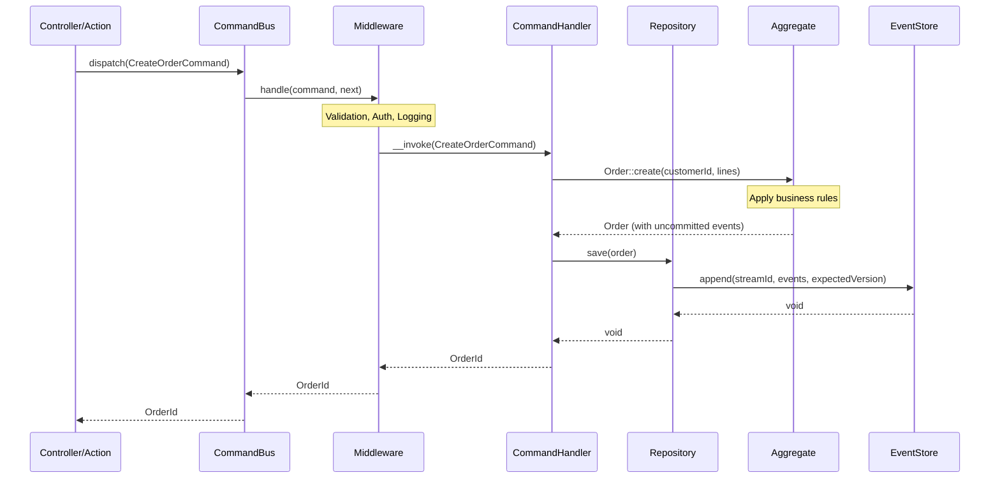

### Command with Domain Validation

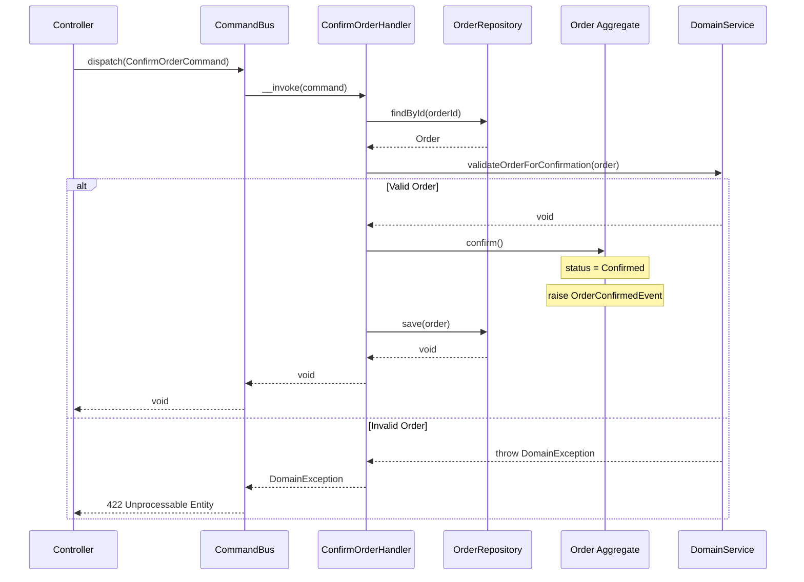

### Command with Saga Coordination

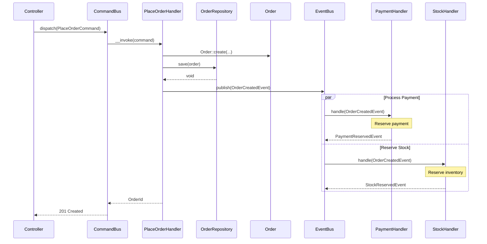

## Query Flow (CQRS Read Side)

### Basic Query Dispatch

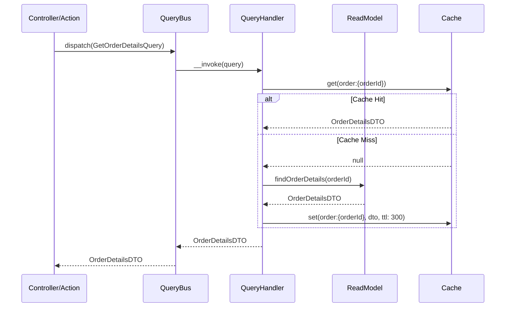

### Paginated List Query

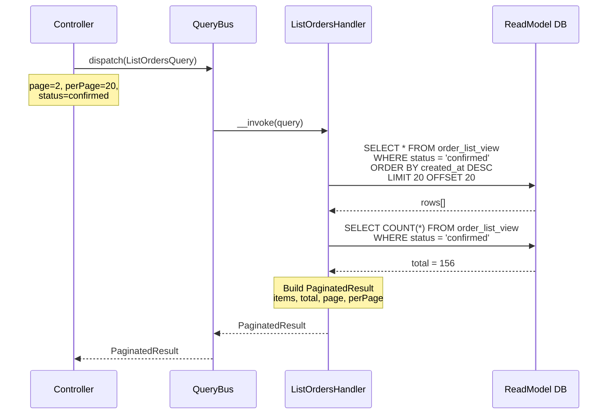

## Event Sourcing Patterns

### Aggregate Reconstitution

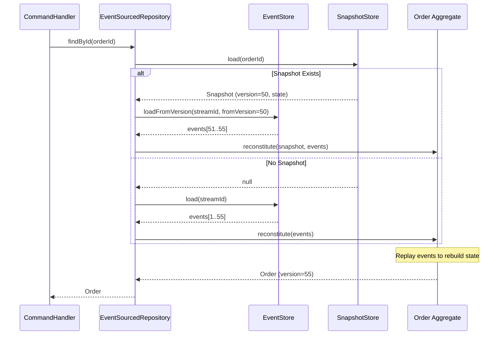

### Event Projection Flow

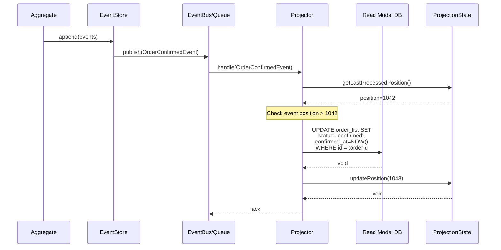

### Full Event Sourcing Cycle

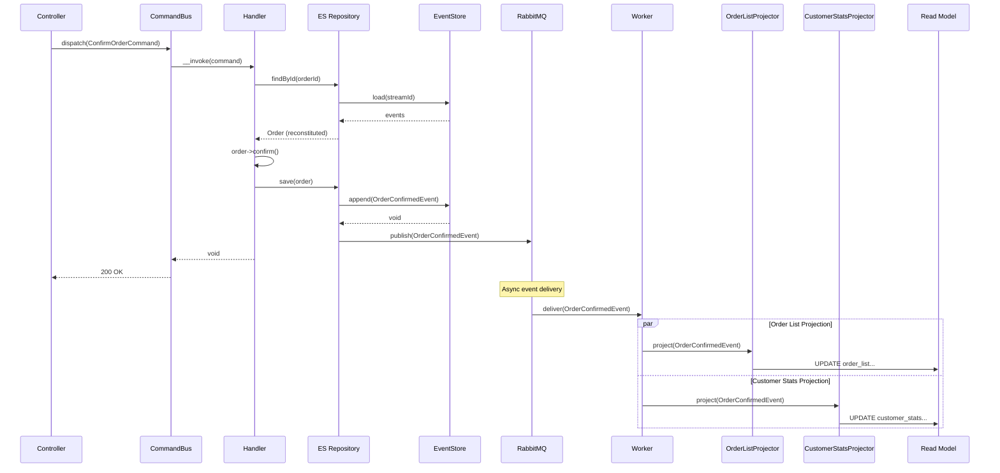

## Saga / Process Manager Patterns

### Orchestration Saga

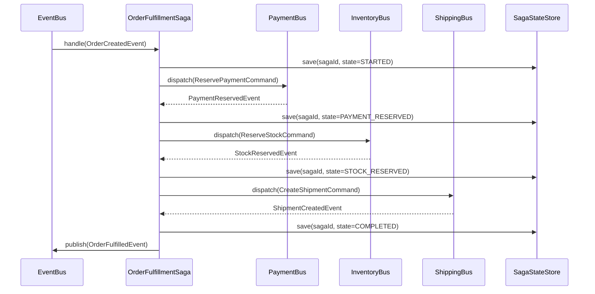

### Saga with Compensation

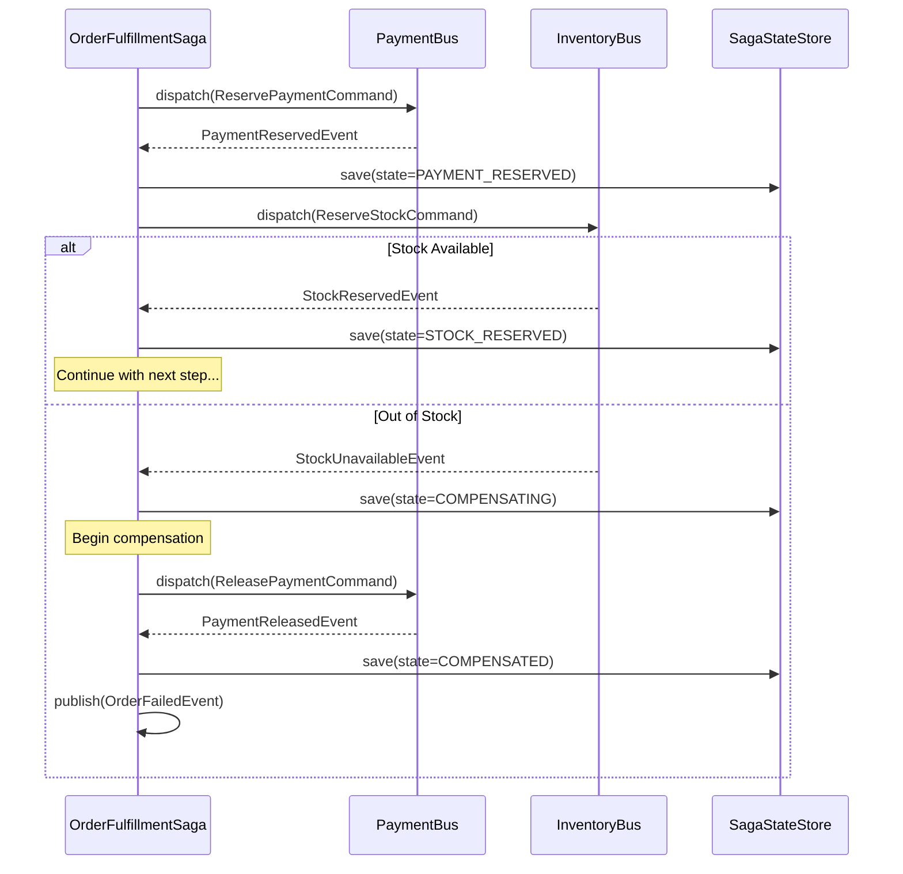

### Choreography Saga

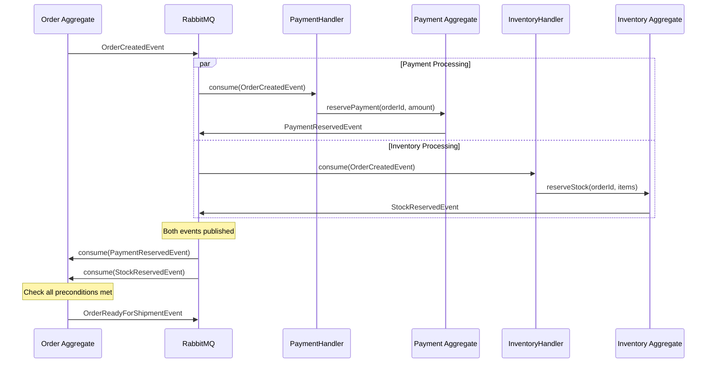

## Async Patterns

### Event-Driven Worker Processing

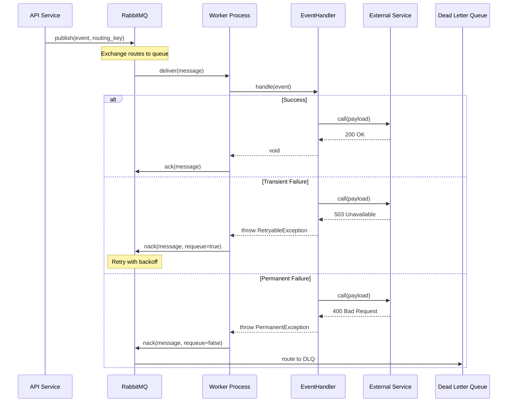

### Scheduled Job Pattern

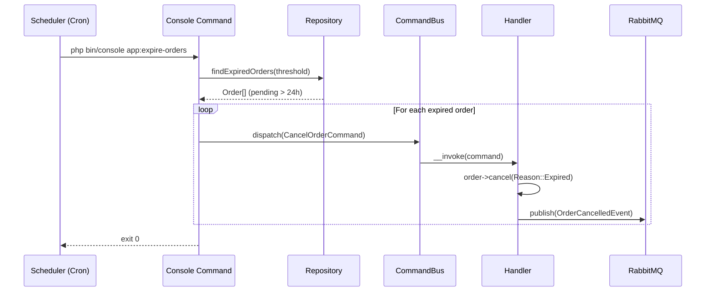

## Error Handling in Sequences

### Optimistic Concurrency Conflict

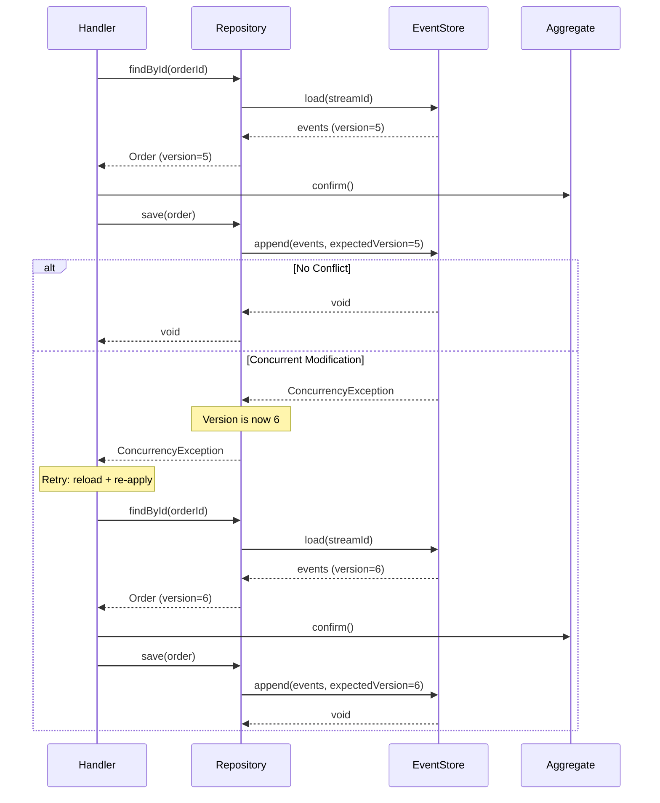

### Circuit Breaker Pattern

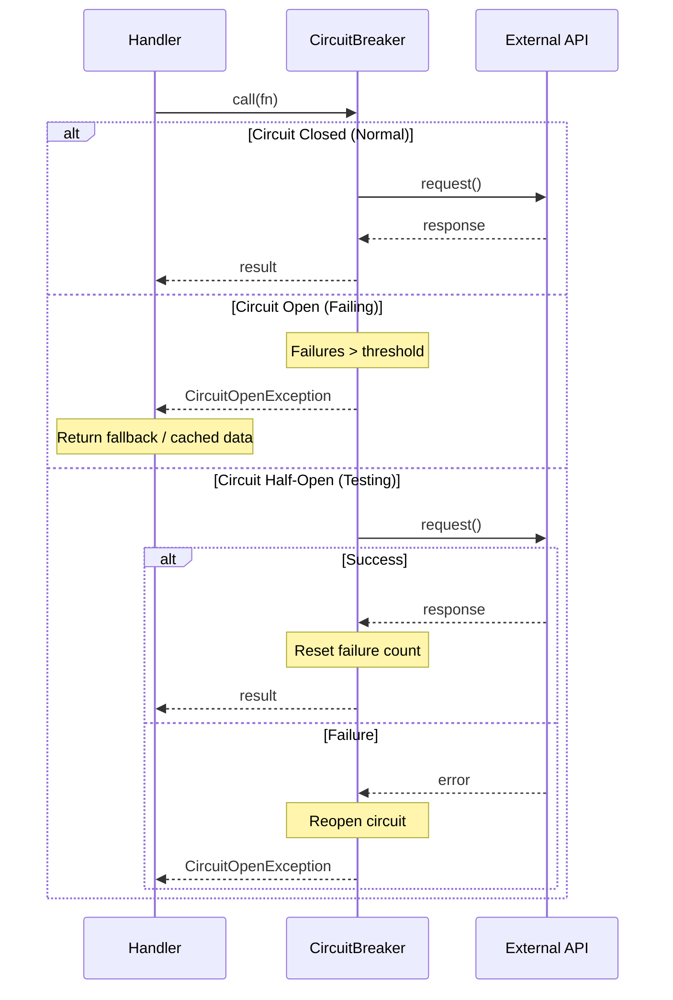

## Common DDD Interaction Patterns

### Anti-Corruption Layer

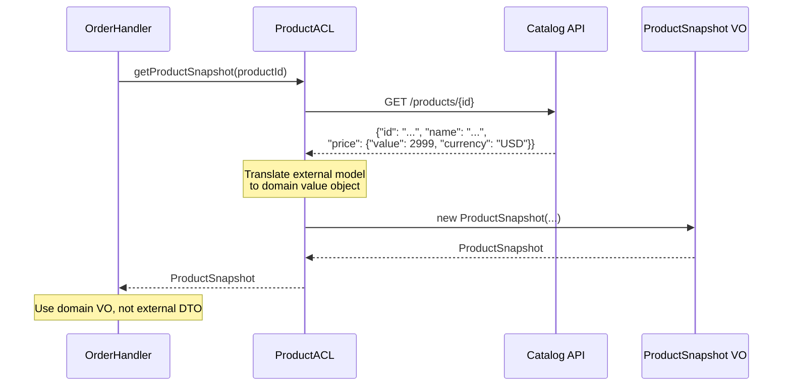

### Domain Event Notification

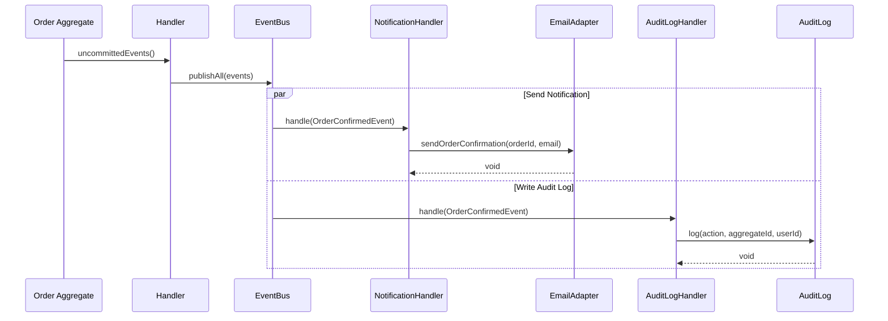

## Detection Patterns

```bash
# Check for sequence diagram documentation
Grep: "sequenceDiagram" --glob "**/*.md"

# Check for CQRS flow documentation
Grep: "CommandBus|QueryBus" --glob "**/docs/**/*.md"

# Check for saga patterns
Grep: "Saga|ProcessManager|Orchestrat" --glob "**/*.php"
Grep: "compensation|compensate" --glob "**/*.php"

# Check for async patterns
Grep: "RabbitMQ|AMQP|queue.*publish" --glob "**/*.php"
Grep: "dead.letter|DLQ|dlq" --glob "**/*.php"

# Warning: Missing interaction documentation
# If handlers exist but no sequence diagrams
Glob: **/Handler/**/*Handler.php
Grep: "sequenceDiagram" --glob "**/docs/**/*.md"
```

## Summary

| Pattern | When to Use | Key Participants | Async |
|---------|-------------|------------------|-------|
| **Command Flow** | Any write operation | Controller, Bus, Handler, Aggregate, Repository | No |
| **Query Flow** | Any read operation | Controller, Bus, Handler, ReadModel, Cache | No |
| **Aggregate Reconstitution** | Event-sourced load | Repository, EventStore, SnapshotStore, Aggregate | No |
| **Event Projection** | Read model sync | EventStore, Queue, Projector, ReadModel | Yes |
| **Full ES Cycle** | Complete write+project | All of the above combined | Partial |
| **Orchestration Saga** | Multi-step with central control | Saga, multiple Buses, SagaStateStore | Yes |
| **Compensation Saga** | Rollback on failure | Saga, Buses, compensation commands | Yes |
| **Choreography Saga** | Decoupled multi-step | Aggregates, Queue, Handlers | Yes |
| **Worker Processing** | Background jobs | API, Queue, Worker, Handler, DLQ | Yes |
| **Circuit Breaker** | Unreliable external calls | Handler, CircuitBreaker, External API | No |
| **Anti-Corruption Layer** | Cross-context integration | Handler, ACL, External API, Value Object | No |
| **Domain Event Notification** | Side effects after command | Aggregate, EventBus, multiple Handlers | Partial |
