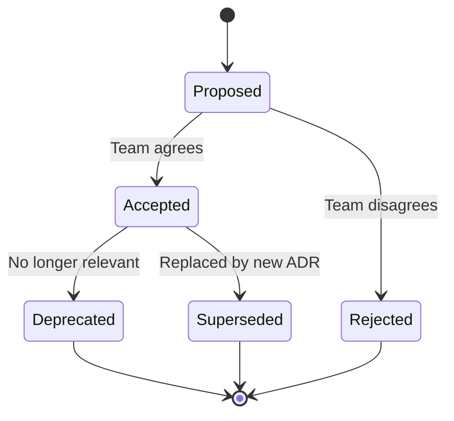

# ADR Format

## Architecture Decision Record Structure

### MADR Template (Markdown ADR)

```markdown
# ADR-{NNN}: {Title}

## Status

{Proposed | Accepted | Deprecated | Superseded by [ADR-NNN](NNN-title.md)}

**Date:** YYYY-MM-DD
**Deciders:** {names or roles}

## Context

Describe the situation and the problem that needs to be addressed.
Include technical context, constraints, and forces at play.

## Decision

State the decision clearly. Use active voice:
"We will use X for Y because Z."

## Consequences

### Positive
- Benefit 1
- Benefit 2

### Negative
- Tradeoff 1
- Tradeoff 2

### Neutral
- Side effect 1

## Alternatives Considered

### Alternative A: {name}
- **Pros:** ...
- **Cons:** ...
- **Rejected because:** ...

### Alternative B: {name}
- **Pros:** ...
- **Cons:** ...
- **Rejected because:** ...
```

## PHP Project ADR Examples

### ADR-001: Use Doctrine ORM

```markdown
# ADR-001: Use Doctrine ORM for Persistence

## Status

Accepted

**Date:** 2025-03-15
**Deciders:** Tech Lead, Senior Developers

## Context

We need an ORM for our DDD project that supports:
- Repository pattern with domain interfaces
- Value Object mapping via Embeddables
- Identity Map for aggregate consistency
- Event-driven lifecycle hooks
- PHP 8.4 property promotion and readonly support

The project follows Clean Architecture where Domain layer has
no dependencies on infrastructure frameworks.

## Decision

We will use Doctrine ORM 3.x as our persistence layer because it:
- Supports Data Mapper pattern (entities are POPOs, no base class)
- Provides Embeddable for Value Object mapping
- Supports custom DBAL types for domain-specific types
- Has mature migration tooling (doctrine/migrations)
- Integrates with Symfony via doctrine-bundle

Repository interfaces are defined in the Domain layer.
Doctrine implementations reside in Infrastructure.

## Consequences

### Positive
- Entities remain POPO — no framework coupling in Domain
- Embeddables map Value Objects without serialization hacks
- Built-in Unit of Work and Identity Map ensure consistency
- XML/attribute mapping keeps entities clean

### Negative
- Learning curve for developers used to Active Record
- Lazy loading proxies require careful handling in DDD
- Aggregate boundary enforcement is manual (no built-in support)
- Performance tuning requires understanding of DQL and hydration

### Neutral
- Team needs to learn Doctrine-specific mapping configuration
- Migration workflow integrated into deployment pipeline

## Alternatives Considered

### Alternative A: Cycle ORM
- **Pros:** Modern PHP, annotation-free, good performance
- **Cons:** Smaller ecosystem, fewer learning resources
- **Rejected because:** Less mature Symfony integration, smaller community

### Alternative B: Raw PDO + Custom Mapper
- **Pros:** Full control, no ORM overhead, simple queries
- **Cons:** Manual mapping, no identity map, no migrations
- **Rejected because:** Too much boilerplate for complex domain model
```

### ADR-002: Use RabbitMQ for Messaging

```markdown
# ADR-002: Use RabbitMQ for Asynchronous Messaging

## Status

Accepted

**Date:** 2025-03-20
**Deciders:** Tech Lead, Platform Engineer

## Context

The system needs asynchronous event processing for:
- Domain event propagation between bounded contexts
- Read model projection updates (CQRS)
- Email/notification delivery
- Retry mechanisms for failed operations

Requirements:
- At-least-once delivery guarantees
- Dead letter queue support
- Message routing (topic-based)
- PHP 8.4 integration via Symfony Messenger

## Decision

We will use RabbitMQ 3.13 with AMQP protocol because it:
- Provides reliable message delivery with acknowledgments
- Supports dead letter exchanges for failed message handling
- Offers flexible routing via exchanges (direct, topic, fanout)
- Integrates with Symfony Messenger via messenger transport

## Consequences

### Positive
- Reliable event delivery between bounded contexts
- Dead letter queues catch and preserve failed messages
- Topic exchanges enable flexible event routing
- Native support in Symfony Messenger transport

### Negative
- Additional infrastructure component to maintain
- Message ordering is per-queue only (not global)
- Requires monitoring (queue depth, consumer lag)
- Serialization format must be standardized across contexts

## Alternatives Considered

### Alternative A: Apache Kafka
- **Pros:** Event log, replay, high throughput, global ordering per partition
- **Cons:** Heavier infrastructure, PHP client less mature
- **Rejected because:** Overkill for current scale; RabbitMQ simpler to operate

### Alternative B: Redis Streams
- **Pros:** Already using Redis, simple setup, consumer groups
- **Cons:** No dead letter support, less durable, limited routing
- **Rejected because:** Insufficient delivery guarantees for domain events
```

### ADR-003: Use JWT for API Authentication

```markdown
# ADR-003: Use JWT for API Authentication

## Status

Accepted

**Date:** 2025-04-01
**Deciders:** Tech Lead, Security Engineer

## Context

The REST API needs stateless authentication for:
- Horizontal scaling (no shared session state)
- Microservice-to-microservice communication
- Mobile and SPA client support
- Token-based authorization with claims

## Decision

We will use JWT (RS256) with short-lived access tokens (15 min)
and long-lived refresh tokens (30 days) stored in HTTP-only cookies.

Implementation: lexik/jwt-authentication-bundle with Symfony Security.

## Consequences

### Positive
- Stateless authentication enables horizontal scaling
- RS256 allows token verification without shared secret
- Claims carry authorization data (roles, context permissions)
- Refresh tokens enable session extension without re-login

### Negative
- Tokens cannot be revoked before expiry (mitigated by short TTL)
- Token size larger than session ID
- Requires secure key management (RSA key pair)

## Alternatives Considered

### Alternative A: Session-based (Redis)
- **Pros:** Simple revocation, small cookie
- **Cons:** Shared state, Redis dependency for auth
- **Rejected because:** Adds statefulness, complicates scaling

### Alternative B: OAuth2 + Opaque Tokens
- **Pros:** Standard protocol, revocable tokens
- **Cons:** Requires token introspection endpoint, added latency
- **Rejected because:** Added complexity for internal API
```

## ADR Lifecycle

### Status Transitions



### Lifecycle Rules

| Status | Meaning | Action |
|--------|---------|--------|
| **Proposed** | Under discussion | Open for review |
| **Accepted** | Decision made | Implement |
| **Deprecated** | No longer applies | Context changed |
| **Superseded** | Replaced by newer ADR | Link to replacement |
| **Rejected** | Not adopted | Document reasons |

## Storage and Numbering

### Directory Structure

```
docs/
└── adr/
    ├── README.md           # ADR index with links
    ├── 001-use-ddd-architecture.md
    ├── 002-event-sourcing-for-orders.md
    ├── 003-cqrs-read-write-separation.md
    ├── 004-rabbitmq-for-messaging.md
    └── 005-jwt-authentication.md
```

### ADR Index (README.md)

```markdown
# Architecture Decision Records

| ADR | Title | Status | Date |
|-----|-------|--------|------|
| [001](001-use-ddd-architecture.md) | Use DDD with Clean Architecture | Accepted | 2025-03-10 |
| [002](002-event-sourcing-for-orders.md) | Event Sourcing for Order context | Accepted | 2025-03-15 |
| [003](003-cqrs-read-write-separation.md) | CQRS read/write separation | Accepted | 2025-03-15 |
| [004](004-rabbitmq-for-messaging.md) | RabbitMQ for async messaging | Accepted | 2025-03-20 |
| [005](005-jwt-authentication.md) | JWT for API authentication | Accepted | 2025-04-01 |
```

### Naming Convention

```
{NNN}-{kebab-case-title}.md

Examples:
001-use-ddd-architecture.md
002-event-sourcing-for-orders.md
015-migrate-to-postgresql-16.md
```

## Detection Patterns

```bash
# Find ADR directory
Glob: docs/adr/*.md

# Check ADR format compliance
Grep: "## Status|## Context|## Decision|## Consequences" --glob "docs/adr/*.md"

# Find superseded ADRs
Grep: "Superseded by" --glob "docs/adr/*.md"

# Check for ADR index
Glob: docs/adr/README.md
```

## Summary

| Field | Purpose | Example |
|-------|---------|---------|
| **Status** | Current state of the decision | Accepted |
| **Date** | When the decision was made | 2025-03-15 |
| **Deciders** | Who made the decision | Tech Lead, Senior Developers |
| **Context** | Why the decision was needed | Need ORM supporting DDD patterns |
| **Decision** | What was decided | Use Doctrine ORM 3.x |
| **Consequences** | Impact of the decision | Entities stay POPO, learning curve |
| **Alternatives** | What else was considered | Cycle ORM, raw PDO |
