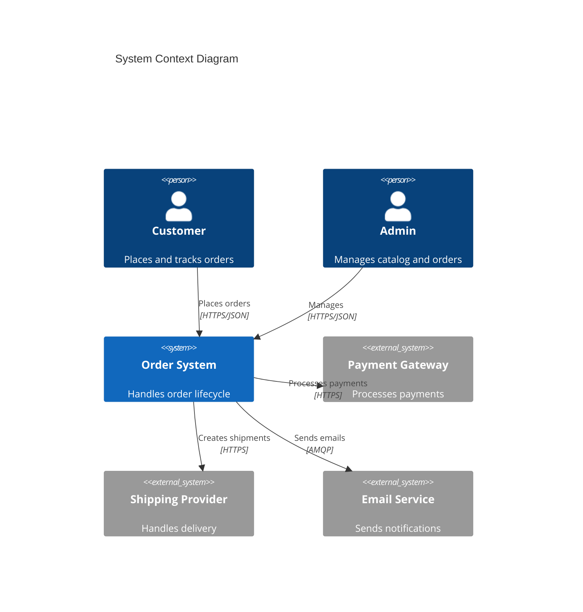
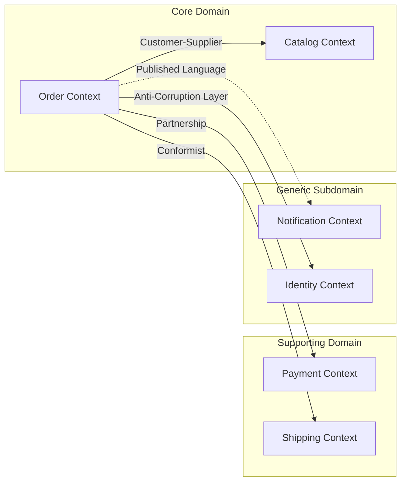
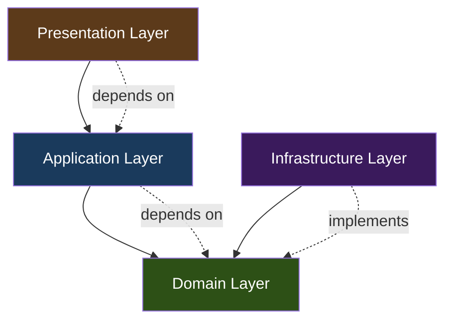
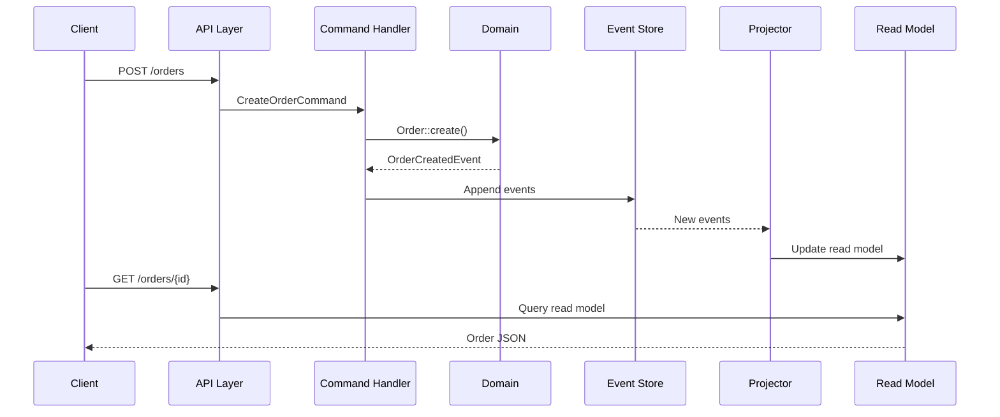
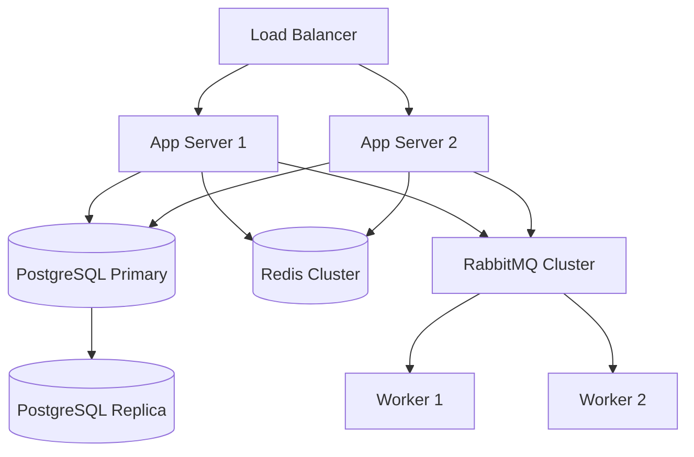

# Architecture Documentation

## ARCHITECTURE.md Structure for DDD Projects

### Complete Template

```markdown
# Architecture

## Overview

Brief description of the system purpose and key architectural decisions (2-3 sentences).
This system follows Domain-Driven Design with Clean Architecture, using CQRS for
command/query separation and Event Sourcing for the Order bounded context.

## System Context



## Bounded Contexts

### Context Map



### Context Details

| Context | Type | Aggregates | Integration |
|---------|------|------------|-------------|
| **Order** | Core | Order, OrderLine | Event Sourcing + CQRS |
| **Catalog** | Core | Product, Category | CRUD + Cache |
| **Payment** | Supporting | Payment, Refund | ACL to Stripe |
| **Shipping** | Supporting | Shipment, Tracking | Conformist to DHL |
| **Notification** | Generic | Template, Channel | Async via RabbitMQ |

## Layer Dependencies



### Layer Rules

| Rule | Description | Enforcement |
|------|-------------|-------------|
| Domain has no dependencies | No framework, no infrastructure imports | PHPStan rules, Deptrac |
| Application depends on Domain only | Interfaces in Domain, implementations in Infrastructure | Deptrac config |
| Infrastructure implements Domain | Repository interfaces defined in Domain | Interface compliance |
| Presentation calls Application | Actions/Controllers call UseCases/Services | Architectural tests |

## Technology Stack

| Layer | Technology | Purpose |
|-------|------------|---------|
| Presentation | Symfony 7.2 | HTTP routing, request handling |
| Application | PHP 8.4 | Business orchestration |
| Domain | PHP 8.4 (no deps) | Business logic |
| Database | PostgreSQL 16 | Primary persistence |
| Cache | Redis 7 | Read model cache, sessions |
| Queue | RabbitMQ 3.13 | Async event processing |
| Search | Elasticsearch 8 | Full-text search read model |
| Monitoring | Prometheus + Grafana | Metrics and alerting |

## Data Flow



## Decisions

Architecture Decision Records are stored in `docs/adr/`.

| ADR | Title | Status |
|-----|-------|--------|
| [ADR-001](docs/adr/001-use-ddd-architecture.md) | Use DDD with Clean Architecture | Accepted |
| [ADR-002](docs/adr/002-event-sourcing-for-orders.md) | Event Sourcing for Order context | Accepted |
| [ADR-003](docs/adr/003-cqrs-read-write-separation.md) | CQRS read/write separation | Accepted |
| [ADR-004](docs/adr/004-rabbitmq-for-messaging.md) | RabbitMQ for async messaging | Accepted |

## Deployment


```

## Documenting Bounded Context Relationships

### Integration Patterns

```markdown
### Order → Payment Integration

**Pattern:** Anti-Corruption Layer (ACL)

The Order context communicates with Payment via an ACL that translates
between domain models. The Payment ACL hides Stripe-specific details.

```php
// Domain interface (Order context)
interface PaymentGatewayInterface
{
    public function charge(OrderId $orderId, Money $amount): PaymentResult;
}

// ACL implementation (Infrastructure)
final readonly class StripePaymentGateway implements PaymentGatewayInterface
{
    public function charge(OrderId $orderId, Money $amount): PaymentResult
    {
        $stripeCharge = $this->stripe->charges->create([
            'amount' => $amount->cents(),
            'currency' => $amount->currency()->value,
            'metadata' => ['order_id' => $orderId->value],
        ]);

        return PaymentResult::fromStripe($stripeCharge);
    }
}
```

**Events published:** `OrderPaidEvent`, `PaymentFailedEvent`
**Events consumed:** none (initiator)
```

## Detection Patterns

```bash
# Check architecture docs exist
Glob: docs/architecture/README.md
Glob: ARCHITECTURE.md

# Check for C4 diagrams
Grep: "C4Context|C4Container|C4Component" --glob "docs/**/*.md"

# Check for bounded context documentation
Grep: "Bounded Context|Context Map" --glob "docs/**/*.md"

# Check for ADR references
Grep: "ADR|Architecture Decision" --glob "docs/architecture/**/*.md"

# Check for layer documentation
Grep: "Presentation Layer|Application Layer|Domain Layer|Infrastructure Layer" --glob "docs/**/*.md"
```

## Summary

| Section | Purpose | Audience |
|---------|---------|----------|
| **Overview** | System purpose and key decisions | Everyone |
| **System Context** | External dependencies and actors | Architects, new developers |
| **Bounded Contexts** | Domain decomposition and relationships | Domain experts, developers |
| **Layer Dependencies** | Code organization and dependency rules | Developers |
| **Technology Stack** | Tools and frameworks used | DevOps, new developers |
| **Data Flow** | Request processing and event flow | Developers, testers |
| **Decisions** | Why choices were made (links to ADRs) | Architects, future maintainers |
| **Deployment** | Infrastructure and scaling | DevOps, SREs |
