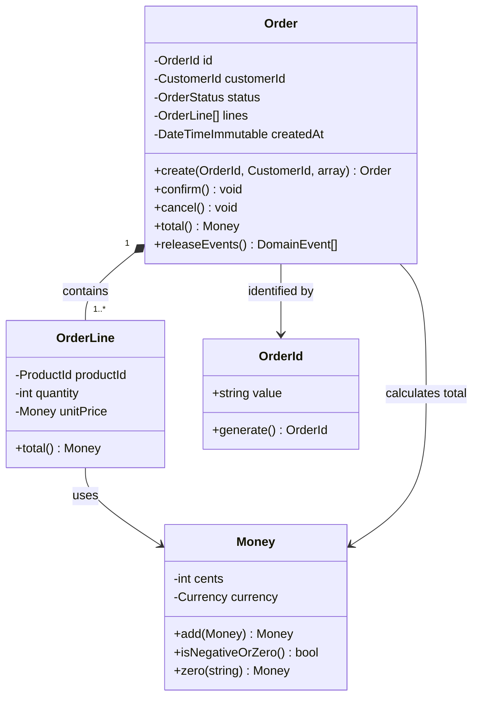
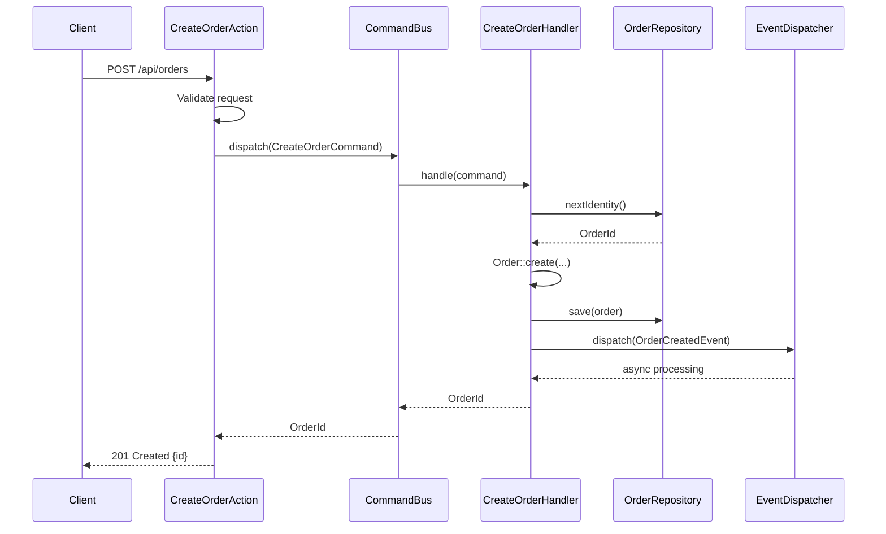
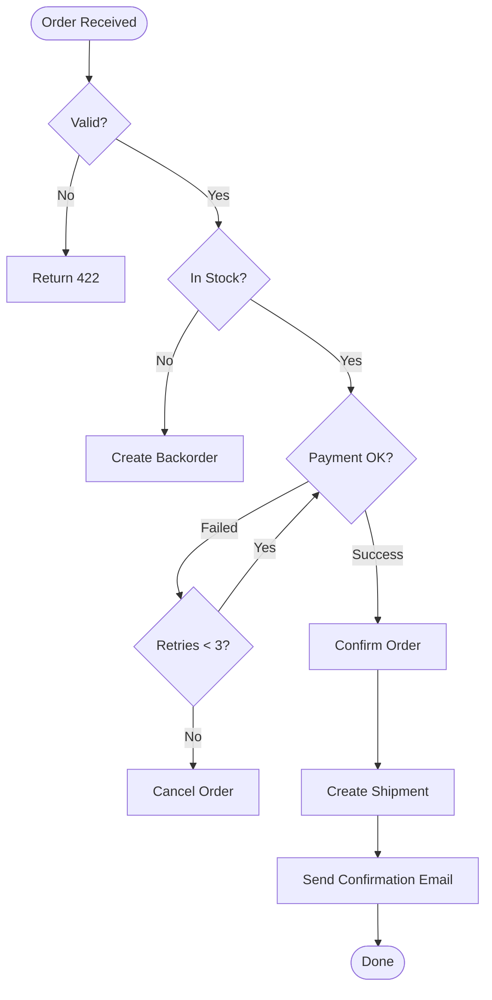
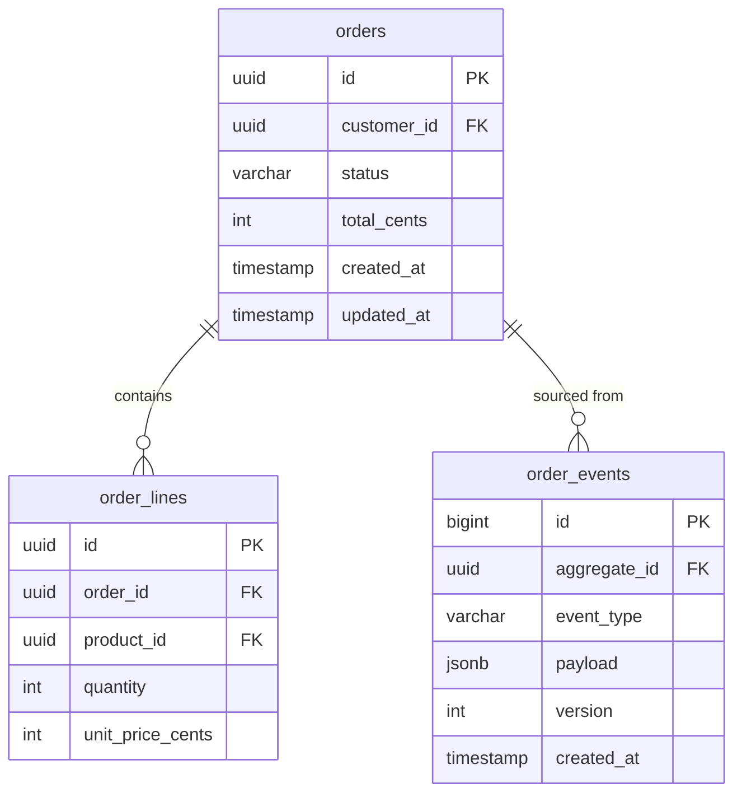
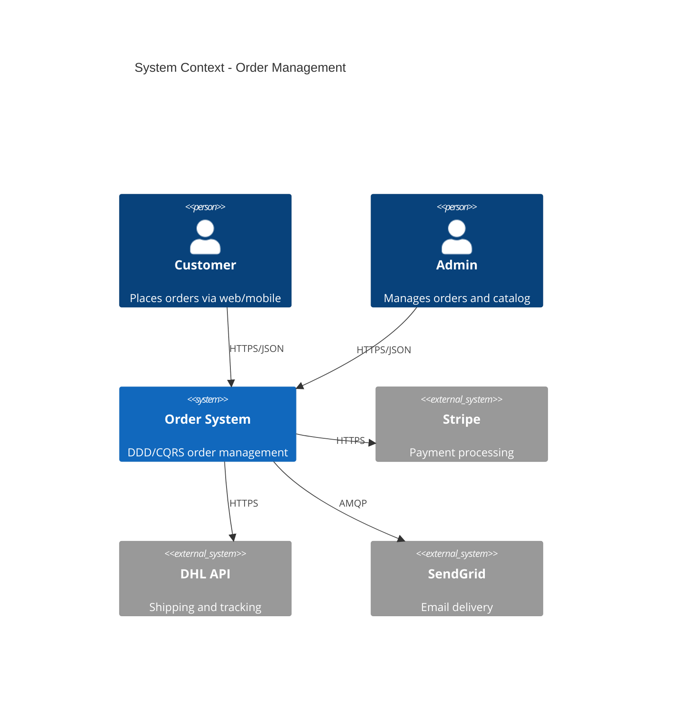
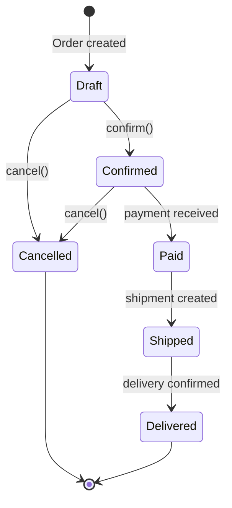

# Diagramming

## Mermaid Diagrams in Documentation

### Why Mermaid

- Rendered natively in GitHub, GitLab, and most markdown viewers
- Text-based: version-controlled alongside code
- No external tools needed for authoring
- Supports class, sequence, flowchart, ER, C4, state, and Gantt diagrams

## Diagram Types

### Class Diagram

Best for documenting domain model structure, aggregate boundaries, and Value Objects.



### Sequence Diagram

Best for documenting request flows, command handling, and event processing.



### Flowchart

Best for documenting business processes, decision logic, and workflows.



### Entity-Relationship Diagram

Best for documenting database schema and read model structure.



### C4 Diagram

Best for documenting system architecture at different zoom levels.



### State Diagram

Best for documenting entity lifecycle, aggregate state transitions, and workflow statuses.



## Diagram Placement Guidelines

### Where to Place Diagrams

| Location | Diagram Type | Purpose |
|----------|-------------|---------|
| `README.md` | Flowchart | High-level system overview |
| `docs/architecture/` | C4, Class | Architecture documentation |
| `docs/api/` | Sequence | API request flows |
| `docs/adr/` | Flowchart, Class | Decision context |
| Bounded context `README.md` | Class, ER | Context-specific model |
| `CONTRIBUTING.md` | Flowchart | Development workflow |

### Sizing Rules

| Guideline | Recommendation |
|-----------|---------------|
| Max nodes per diagram | 9-12 (cognitive limit) |
| Max depth | 4 levels |
| Labels | Always use descriptive labels on edges |
| Node IDs | Use meaningful names, not A/B/C |
| Direction | Top-down for hierarchy, left-right for flow |

## Auto-Generating Diagrams

### From PHP Code (Class Diagrams)

```bash
# Using php-class-diagram (Smeghead)
vendor/bin/php-class-diagram src/Domain/Order/ --format mermaid > docs/diagrams/order-domain.md

# Using phpDocumentor class diagram
phpdoc --directory=src/ --target=docs/ --template="clean"
```

### From Database (ER Diagrams)

```bash
# Using SchemaSpy
java -jar schemaspy.jar -t pgsql -db orderdb -o docs/schema/

# Using Doctrine schema dump
bin/console doctrine:schema:create --dump-sql > docs/schema/schema.sql
```

### From OpenAPI (Sequence Diagrams)

```bash
# Generate from OpenAPI spec
npx openapi-to-mermaid openapi.yaml > docs/diagrams/api-flows.md
```

## Detection Patterns

```bash
# Find all Mermaid diagrams
Grep: "```mermaid" --glob "**/*.md"

# Find diagrams with too many nodes (> 12)
Grep: "```mermaid" -A 30 --glob "**/*.md"

# Find diagrams without labels on edges
Grep: "-->|-->" --glob "**/*.md"

# Find non-descriptive node IDs
Grep: "\b[A-B]\[" --glob "**/*.md"
```

## Summary

| Diagram Type | Best For | Example Use Case |
|-------------|----------|-----------------|
| **Class** | Domain model, aggregates | Show Order aggregate with Value Objects |
| **Sequence** | Request flows, event chains | Document command handling pipeline |
| **Flowchart** | Business logic, decisions | Order processing workflow |
| **ER** | Database schema, read models | CQRS read model structure |
| **C4** | System architecture, contexts | Bounded context relationships |
| **State** | Entity lifecycle, workflows | Order status transitions |
| **Gantt** | Project timelines, migration plans | Phased rollout schedule |
