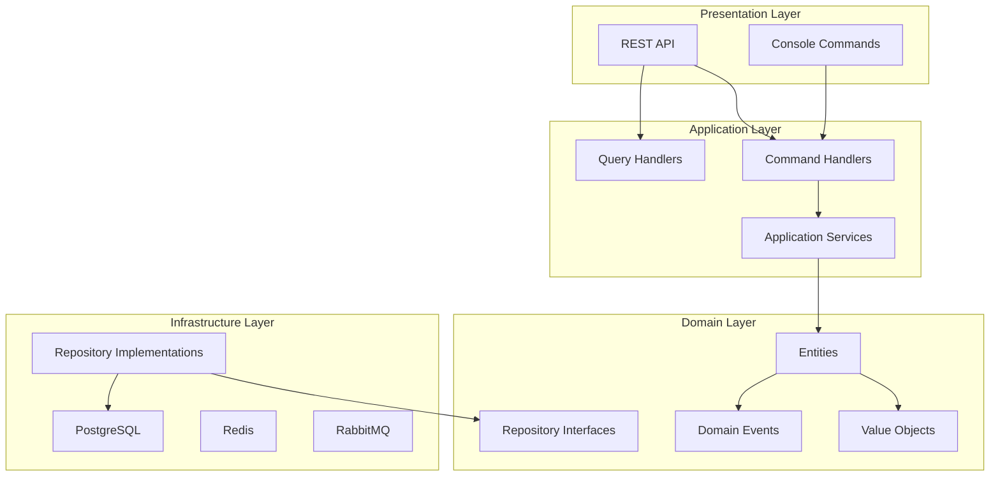

# README Patterns

## Standard PHP Project README

### Full Structure

```markdown
# Project Name

[](https://github.com/owner/repo/actions)
[](https://codecov.io/gh/owner/repo)
[](https://phpstan.org/)
[](https://packagist.org/packages/vendor/package)
[](LICENSE)

Brief description of what the project does and why it exists (1-2 sentences).

## Features

- Type-safe domain model with Value Objects
- CQRS with separate read/write models
- Event Sourcing support
- PHP 8.4+ with strict typing

## Requirements

- PHP 8.4+
- Composer 2.0+
- PostgreSQL 16+ / MySQL 8.0+
- Redis 7+
- RabbitMQ 3.12+

## Installation

```bash
composer require vendor/package
```

## Quick Start

```php
<?php

declare(strict_types=1);

use Vendor\Package\Application\Order\Command\CreateOrderCommand;
use Vendor\Package\Application\Order\CommandHandler\CreateOrderHandler;

$command = new CreateOrderCommand(
    customerId: new CustomerId('550e8400-e29b-41d4-a716-446655440000'),
    lines: [new OrderLineDTO(productId: 'prod-1', quantity: 2, unitPrice: 1999)],
);

$orderId = $handler->handle($command);
echo $orderId->value; // "order-uuid-here"
```

## Documentation

- [Architecture](docs/architecture/README.md)
- [API Reference](docs/api/README.md)
- [Getting Started Guide](docs/guides/getting-started.md)
- [Configuration](docs/reference/configuration.md)
- [ADRs](docs/adr/)

## Testing

```bash
composer test          # Run all tests
composer test:unit     # Unit tests only
composer test:integration  # Integration tests
composer phpstan       # Static analysis (level 9)
```

## Contributing

See [CONTRIBUTING.md](CONTRIBUTING.md) for development setup and guidelines.

## Changelog

See [CHANGELOG.md](CHANGELOG.md) for version history.

## License

MIT License - see [LICENSE](LICENSE) for details.
```

## DDD Project README

### Bounded Context Section

```markdown
## Architecture

This project follows Domain-Driven Design with Clean Architecture.

### Bounded Contexts

| Context | Purpose | Key Aggregates |
|---------|---------|----------------|
| **Order** | Order lifecycle management | Order, OrderLine |
| **Catalog** | Product catalog and pricing | Product, Category |
| **Payment** | Payment processing | Payment, Refund |
| **Shipping** | Delivery management | Shipment, Tracking |

### Architecture Diagram



### Domain Glossary

| Term | Definition | Context |
|------|-----------|---------|
| **Order** | A customer request to purchase products | Order BC |
| **OrderLine** | A single product entry within an order | Order BC |
| **Money** | Value Object representing currency amount | Shared Kernel |
| **CustomerId** | Value Object identifying a customer | Shared Kernel |
```

## Badge Examples

### CI/CD Badges

```markdown
# GitHub Actions
[](https://github.com/owner/repo/actions)

# GitLab CI
[](https://gitlab.com/owner/repo/-/pipelines)
```

### Code Quality Badges

```markdown
# PHPStan Level
[](https://phpstan.org/)

# Code Coverage
[](https://codecov.io/gh/owner/repo)

# Psalm Level
[](https://psalm.dev/)
```

### Package Badges

```markdown
# Packagist Version
[](https://packagist.org/packages/vendor/package)

# PHP Version
[](https://packagist.org/packages/vendor/package)

# Downloads
[](https://packagist.org/packages/vendor/package)

# License
[](LICENSE)
```

## Detection Patterns

```bash
# Check README exists
Glob: README.md

# Check required sections present
Grep: "## Installation|## Usage|## Quick Start" --glob "README.md"

# Check badges present
Grep: "\[!\[" --glob "README.md"

# Check code examples present
Grep: "```php" --glob "README.md"

# Check license section
Grep: "## License|LICENSE" --glob "README.md"

# Check for DDD-specific sections
Grep: "Bounded Context|Architecture|Domain Glossary" --glob "README.md"
```

## Section Order Recommendation

| Order | Section | Required | Purpose |
|-------|---------|----------|---------|
| 1 | Title + Badges | Yes | Identity and status |
| 2 | Description | Yes | What and why |
| 3 | Features | Yes | Value proposition |
| 4 | Requirements | Yes | Prerequisites |
| 5 | Installation | Yes | Setup |
| 6 | Quick Start | Yes | First success |
| 7 | Architecture | DDD | System understanding |
| 8 | Documentation | Yes | Deep-dive links |
| 9 | Testing | Yes | Quality assurance |
| 10 | Contributing | Optional | Community |
| 11 | Changelog | Optional | History |
| 12 | License | Yes | Legal |
