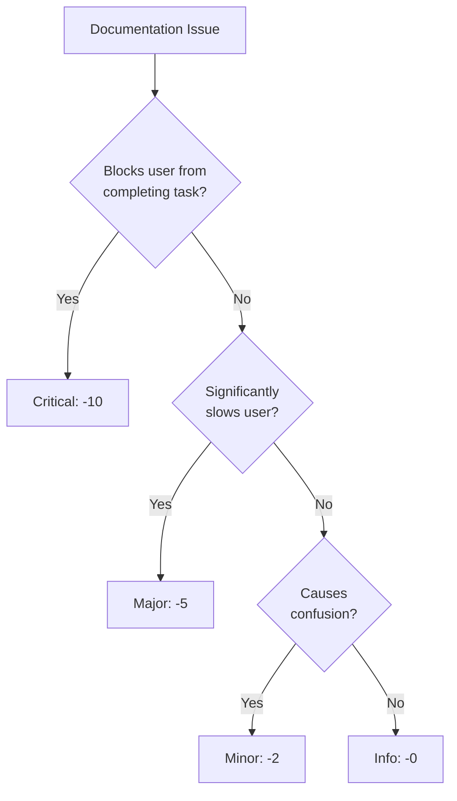

# Scoring Rubrics

## Documentation Quality Scoring System

### Overall Score: 0-100

```
Overall Score = Completeness (25%) + Accuracy (25%) + Clarity (25%) + Maintainability (25%)

Rating:
90-100: Excellent — production-ready documentation
75-89:  Good — minor gaps, usable
60-74:  Adequate — significant gaps, needs improvement
40-59:  Poor — blocks users, needs rework
0-39:   Critical — essentially undocumented
```

## Category 1: Completeness (25 points)

### Subcriteria

| Subcriteria | Points | Description |
|-------------|--------|-------------|
| README sections | 5 | All required sections present (install, usage, license) |
| API coverage | 5 | All public endpoints/methods documented |
| Architecture docs | 5 | System overview, layer descriptions, bounded contexts |
| Setup instructions | 5 | Complete setup from clone to running (Docker, env, migrations) |
| Error documentation | 5 | Error codes, exception types, troubleshooting |

### Scoring Guide

```markdown
5/5 — All items present and thorough
4/5 — All items present, minor gaps
3/5 — Most items present, some sections missing
2/5 — Significant sections missing
1/5 — Only basics present
0/5 — Section entirely missing
```

### Completeness Detection

```bash
# README completeness
Grep: "## Installation" --glob "README.md"      # +1 if found
Grep: "## Usage|## Quick Start" --glob "README.md"  # +1 if found
Grep: "## License" --glob "README.md"            # +1 if found
Grep: "```php" --glob "README.md"                # +1 if code example found
Grep: "\[!\[" --glob "README.md"                 # +1 if badges found

# API documentation coverage
Grep: "public function " --glob "src/**/*.php" | wc -l  # Total public methods
Grep: "@param|@return|#\[OA\\" --glob "src/**/*.php" | wc -l  # Documented methods
# Coverage = documented / total * 100

# Architecture docs
Glob: docs/architecture/README.md
Glob: ARCHITECTURE.md
Grep: "## Bounded Context|## Layer" --glob "docs/**/*.md"
```

## Category 2: Accuracy (25 points)

### Subcriteria

| Subcriteria | Points | Description |
|-------------|--------|-------------|
| Code examples work | 7 | Examples copy-paste correctly, use current API |
| Version consistency | 5 | PHP version, package version match composer.json |
| Path references valid | 5 | All referenced files/directories exist |
| API signatures match | 5 | Documented parameters match actual code |
| Diagram accuracy | 3 | Diagrams reflect current architecture |

### Scoring Guide

```markdown
## Code Example Scoring
7/7 — All examples run successfully with current codebase
5/7 — Examples run but minor issues (deprecated methods, missing imports)
3/7 — Some examples broken, outdated API calls
1/7 — Most examples don't run
0/7 — No working examples or no examples at all

## Version Scoring
5/5 — All versions match (README, composer.json, Docker, CI)
3/5 — Minor mismatches (patch version differs)
1/5 — Major version mismatches
0/5 — No version information or completely wrong
```

### Accuracy Detection

```bash
# Version mismatch check
Grep: "\"php\":" --glob "composer.json"
Grep: "PHP [0-9]+\.[0-9]+" --glob "README.md"
# Compare values — must match

# Path reference validation
Grep: "\]\([^http][^\)]+\)" --glob "**/*.md"
# For each relative link, verify file exists

# Namespace accuracy
Grep: "use [A-Z][A-Za-z\\\\]+" --glob "docs/**/*.md"
# Verify each namespace exists in src/
```

## Category 3: Clarity (25 points)

### Subcriteria

| Subcriteria | Points | Description |
|-------------|--------|-------------|
| Scannable structure | 5 | Headers, bullets, tables used effectively |
| Jargon explained | 5 | DDD/CQRS terms defined on first use or in glossary |
| Task-oriented | 5 | "How to X" focus rather than "Feature X exists" |
| Code before prose | 5 | Examples appear before lengthy explanation |
| Consistent terminology | 5 | Same concept uses same name everywhere |

### Scoring Guide

```markdown
## Scannability Scoring
5/5 — Clear header hierarchy, tables for comparisons, bullets for lists
3/5 — Some structure but long paragraphs, inconsistent formatting
1/5 — Wall of text, no visual hierarchy
0/5 — Unreadable or single block of text

## Jargon Scoring
5/5 — All DDD/CQRS terms explained: Aggregate, Value Object, Bounded Context, etc.
3/5 — Most terms explained but some assumed knowledge
1/5 — Heavy jargon without definitions
0/5 — Documentation requires expert knowledge to parse
```

### Clarity Detection

```bash
# Find undefined acronyms
Grep: "\b(DDD|CQRS|VO|DTO|ACL|BC|ES|ADR)\b" --glob "docs/**/*.md"
# Check if definition appears near first usage

# Find long paragraphs (walls of text)
# Manual review: any paragraph > 5 lines without a break

# Check for glossary
Grep: "## Glossary|## Terms|## Definitions" --glob "docs/**/*.md"
```

## Category 4: Maintainability (25 points)

### Subcriteria

| Subcriteria | Points | Description |
|-------------|--------|-------------|
| Doc-as-code workflow | 5 | Docs in git, updated via PRs, CI validates |
| Auto-generation | 5 | PHPDoc, OpenAPI, changelog generated from code/commits |
| Link integrity | 5 | No broken internal/external links |
| Update process | 5 | Clear rules for when docs must be updated |
| Modular structure | 5 | Docs split by topic, no single monolithic file |

### Scoring Guide

```markdown
## Doc-as-Code Scoring
5/5 — Docs in repo, PR template mentions docs, CI checks markdown
3/5 — Docs in repo but no CI validation, optional doc updates
1/5 — Docs in repo but rarely updated
0/5 — Docs in external wiki or missing entirely

## Auto-Generation Scoring
5/5 — API docs from attributes, changelog from commits, TOC auto-generated
3/5 — Some auto-generation (PHPDoc) but manual changelog
1/5 — Everything manual
0/5 — No generation tooling
```

### Maintainability Detection

```bash
# Check for CI doc validation
Grep: "markdownlint|markdown-link-check|doctoc" --glob ".github/workflows/*.yml"
Grep: "markdownlint|markdown-link-check" --glob ".gitlab-ci.yml"

# Check for auto-generated sections
Grep: "<!-- AUTO-GENERATED -->|<!-- TOC -->" --glob "**/*.md"

# Check modular structure (not monolithic)
wc -l docs/**/*.md  # Flag files > 500 lines
```

## Severity Levels

### Issue Classification

| Severity | Score Impact | Description | Example |
|----------|-------------|-------------|---------|
| **Critical** | -10 per issue | Blocks user success | Missing install instructions, broken examples |
| **Major** | -5 per issue | Significant hindrance | Missing API docs for key endpoints |
| **Minor** | -2 per issue | Small inconvenience | Missing badge, typo in example |
| **Info** | -0 | Nice to have | Could add more examples, better formatting |

### Severity Decision Tree



## Example Scoring: PHP DDD Project

### Sample Audit

```markdown
# Documentation Audit: Order Management Service

## Completeness (25 points)
- README sections:        4/5  (missing requirements section)
- API coverage:           3/5  (Payment endpoints undocumented)
- Architecture docs:      5/5  (full C4 diagrams, context map)
- Setup instructions:     4/5  (Docker setup complete, .env.example missing)
- Error documentation:    2/5  (only 4xx codes, no domain exceptions)
**Subtotal: 18/25**

## Accuracy (25 points)
- Code examples work:     5/7  (2 examples use deprecated method)
- Version consistency:    5/5  (all versions match)
- Path references valid:  4/5  (one broken link to old diagram)
- API signatures match:   4/5  (OrderDTO changed, docs not updated)
- Diagram accuracy:       3/3  (all diagrams current)
**Subtotal: 21/25**

## Clarity (25 points)
- Scannable structure:    5/5  (good header hierarchy, tables)
- Jargon explained:       4/5  (missing "ACL" definition)
- Task-oriented:          4/5  (some feature-centric sections)
- Code before prose:      5/5  (examples first pattern used)
- Consistent terminology: 3/5  ("VO" and "Value Object" used interchangeably)
**Subtotal: 21/25**

## Maintainability (25 points)
- Doc-as-code workflow:   5/5  (CI validates, PR template includes docs)
- Auto-generation:        3/5  (PHPDoc only, manual changelog)
- Link integrity:         4/5  (1 broken link found)
- Update process:         4/5  (PR template, no formal doc review step)
- Modular structure:      5/5  (well-organized docs/ directory)
**Subtotal: 21/25**

## Final Score: 81/100 — Good
```

## Summary

| Category | Weight | Criteria | Max Score |
|----------|--------|----------|-----------|
| **Completeness** | 25% | README, API, architecture, setup, errors | 25 |
| **Accuracy** | 25% | Examples, versions, paths, signatures, diagrams | 25 |
| **Clarity** | 25% | Structure, jargon, task focus, code-first, terms | 25 |
| **Maintainability** | 25% | CI, auto-gen, links, update process, modularity | 25 |
| **Total** | 100% | All categories combined | **100** |
